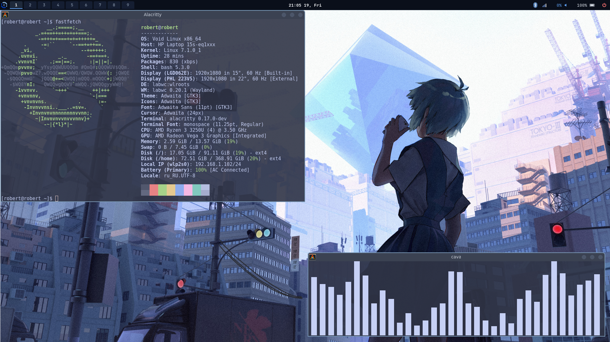

# Labwc-config

---

## Hotkey 

| Hotkey | Action |
|---|---|
| Win + W | Open Alacritty |
| Win + E | Open Browser(firefox) |
| Win + S | Shearch applications(fuzzle) |
| Win + D | Open Thunar |
| Win + Z | Select wallpaper(swww) |
| Win + 1-9 | Quickly switch between workspaces |
| Lctrl + Lalt + Right-Left | Sequential switching between workspaces |


---

## Install 

```
git clone https://github.com/rei-root/Labwc-config.git
cd Labwc-config
cp -r fuzzel labwc mako waybar alacritty ~/.config/
cp -r themes ~/.themes/
```
(It's also a good idea to install the packages listed in "Required_packages.txt," but it's full of junk, so do it at your own risk if you want to clutter up your system)

```
sudo xbps-install -Syu $(cat Required_packages.txt)
```

To add user daemons for ranit you need to:

```
cp -r service ~/.config/
```

---

## Grub Theme 

If you want to install the Grab theme, you need to do the following:

```
sudo mkdir -p /boot/grub/themes
sudo cp -r mahiro-grub /boot/grub/themes/
sudo nano /etc/default/grub
```
At this point, you need to add this line to the grab config:
```
GRUB_THEME="/boot/grub/themes/mahiro-grub/theme.txt"
```
And comment out this line by adding a hash mark before the no:
```
GRUB_TERMINAL_OUTPUT=console
```
---
## Alacritty smooth cursor 

For a smooth cursor in alacritty you need to install this: 
https://github.com/GregTheMadMonk/alacritty-smooth-cursor

---

## Set wallpaper

The default path swww uses to look for my wallpapers is ~/Pictures/Wallpaper/. You can create the desired folder or change the current one to your own in the script at ~/.config/labwc/scripts/wallpaper-select.sh

---

## Rice screenshot

### Rice screenshot: 


### Grub Theme:

